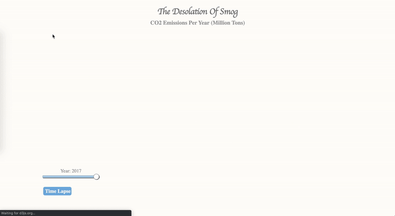
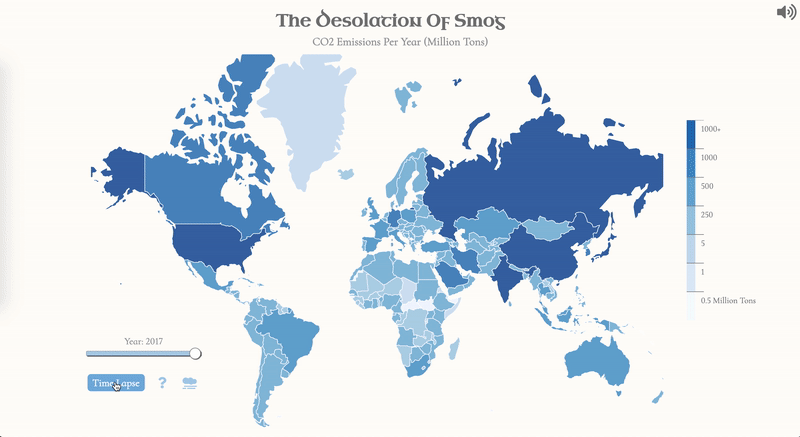

# TheDesolationOfSmog

[TheDesolationOfSmog site](https://https://bbriannwalshh.github.io/TheDesolationOfSmog/)

`The Desolation Of Smog` is a data visualization that uses yearly emissions data, differentiated by year and country, intended to convey the gravity of climate change. It can be very difficult to understand what our impact is on climate change, so my goal was to not only show the amount of CO2 emitted per country over time, but also to provide more context on what a single metric ton of CO2 really means to your average person.
This application was built with D3, Vanilla Javascript & HTML5, using emissions data from OWID based on the Global Carbon Project; Carbon Dioxide Information Analysis Centre (CDIAC); Gapminder and UN population estimates

## Technology used:
* D3 Javascript Library
* Vanilla Javascript

## Features
D3 was used to create a world map using geoJson mapping and csv data, with each country's color representing the amount of CO2 emmited by them each year. Javascript was used to create a slidebar that allows the map to re-paint itself based on the year being chosen.



The program opens with a modal explaning the applications intended goals, as well as instructions on how to navigate the page. After clicking out of the modal you can interact with the map. Each country has its own tooltip denoting their name. The map was created using D3 and the geoJson mapping.

```
map = svg.append("g")
  .selectAll("path")
  .data(countries.features)
  .enter()
  .append("path")

  .attr("d", d3.geoPath()
  .projection(projection)
  )

  .attr("fill", function (d) {
    d.total = years[year][d.id] || 0;
    return colorScale(d.total);
  })
```


To create a timelapse effect, and rather than having to create a new map with different colors each time--because that process savierly slowed down the application--the colors are simply re-painted based on what year is being inputted. This, in conjunction with a setInterval function, allows for the program to run through each year, re-painting each countries CO2 emissions, in an efficient manner.  

```
const changeColor = () => {
  let year = document.getElementById("mySlider").value;
  
  map._groups[0].forEach((country) => {
    total = years[year][country.__data__.id] || 0;
    country.setAttribute("fill", colorScale(total));
  });
};
```



If you're still unsure of what a "metric ton of CO2" means, that's okay! If you click next to the Time Lapse button on the icon of a smog cloud another modal will open providing specific information on CO2 emissions.


### Planned future features
* Add more visualization options
